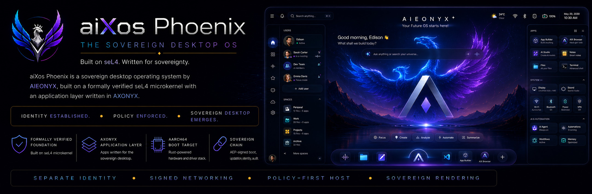

<p align="center">
  
</p>

<p align="center">
  <strong>Built on seL4. Written for sovereignty.</strong>
</p>

<p align="center">
  <a href="https://github.com/aieonyx/aixos/releases/tag/v0.1.0-phoenix-lite">v0.1.0-phoenix-lite</a> •
  <a href="https://github.com/aieonyx/AXON">AXONYX Language</a> •
  <a href="https://github.com/aieonyx/edisondb">EdisonDB</a> •
  <a href="https://github.com/aieonyx/haniel">HANIEL</a> •
  Apache 2.0
</p>

---

## What is aiXos Phoenix?

aiXos is a sovereign desktop operating system by [AIEONYX](https://github.com/aieonyx).
Phoenix is the name of Version 1 — the first era of the aiXos family.
It is built on a formally verified seL4 microkernel with an application layer
written in [AXONYX](https://github.com/aieonyx/AXON) — a sovereign systems programming
language designed from the ground up for this stack.

Every component in the boot chain declares sovereignty:

- **Identity** is established by ARPi ceremony before anything else runs
- **Network packets** are tagged and signed by AWP-Lite
- **Policy** is enforced by BASTION before any user session begins
- **The desktop surface** is rendered by HANIEL — no external GUI toolkit,
  no proprietary driver stack

---

## Current State — aiXos v0.1.0 (Phoenix Lite Edition)

This is the first public release. aiXos Phoenix Lite is a bootable sovereign OS
that runs on aarch64 hardware and QEMU. It boots, establishes identity, enforces
policy, and prints the sovereign proof:

```
aiXos Phoenix - Sovereign Stack Initializing...
axon_main() -> 0x4153
axos>
```

The banner above shows the **proposed full GUI** for aiXos Phoenix v1.0 —
the sovereign desktop as it is designed to look. This is where we are going.
The current release is the foundation that makes it possible.

---

## Boot Sequence

```
_start (boot.s)
  └── aixos_main()
        └── orchestrate()
              └── boot_sequence([
                    GenesisPd,      // seL4 kernel gate
                    ArpiCeremony,   // sovereign identity
                    AwpLite,        // signed networking
                    SovereignShell, // HANIEL rendered shell
                    BastionPd,      // policy enforcement
                  ])
              └── render_banner()
              └── render_proof()   // 0x4153
              └── render_prompt()  // axos>
```

---

## AXONYX — The Sovereign Language (Next Milestone)

[AXONYX](https://github.com/aieonyx/AXON) is the sovereign systems programming
language powering aiXos. In this release, 7 `.ax` files ship as part of the OS:

| File | Purpose |
|------|----------|
| `ceremony.ax` | ARPi identity ceremony |
| `awp_lite.ax` | AWP sovereign protocol |
| `sovereignty.ax` | OS build manifest |
| `shell.ax` | Sovereign shell core |
| `layout.ax` | HANIEL canvas grid |
| `bastion.ax` | Policy + heartbeat |
| `boot/aixos-boot.ax` | Boot mode selection |

**Next milestone:** Full AXONYX application layer — every component that currently
uses a Rust stub will be rewritten in pure `.ax`. aiXos Phoenix v1.0 will be the
first OS where the entire application layer runs in a sovereign language on a
formally verified microkernel.

---

## Sovereign Stack

| Component | Role | Repo |
|-----------|------|------|
| seL4 + ASL | Formally verified microkernel | [asl](https://github.com/aieonyx/asl) |
| AXONYX | Sovereign language | [AXON](https://github.com/aieonyx/AXON) |
| EdisonDB | Sovereign database | [edisondb](https://github.com/aieonyx/edisondb) |
| HANIEL | Sovereign render engine | [haniel](https://github.com/aieonyx/haniel) |
| Onyxia | Sovereign browser | [onyxia](https://github.com/aieonyx/onyxia) |
| ARPi | Identity protocol | built-in |
| AWP | Sovereign network protocol | built-in |
| BASTION | Policy enforcement daemon | built-in |

---

## Roadmap

### aiXos Phoenix Lite (v0.1) — NOW
- [x] seL4 microkernel boot
- [x] ARPi identity ceremony
- [x] AWP-Lite signed networking
- [x] BASTION policy enforcement
- [x] HANIEL sovereign shell surface
- [x] 7 AXONYX .ax files running in the OS
- [x] Bootable on QEMU aarch64

### aiXos Phoenix Full (v1.0) — Next
- [ ] Full AXONYX application layer (zero Rust stubs)
- [ ] HANIEL pixel-perfect desktop surface
- [ ] Onyxia browser integrated
- [ ] EdisonDB persistent sovereign storage
- [ ] AWP full mesh networking
- [ ] Real hardware USB boot (aarch64 + x86_64)
- [ ] AIX Coin sovereign economy layer
- [ ] IAM — Intelligent Assistant to Man

### aiXos v2.0 (Next version name TBD) — Future
- [ ] AXIOM/SOMA hardware identity binding
- [ ] Aegis collective defense
- [ ] Multi-node sovereign mesh
- [ ] Sovereign app ecosystem

---

## How to Run

**Requirements:** QEMU aarch64, Rust (aarch64-unknown-none target),
aarch64-linux-gnu toolchain

```sh
git clone https://github.com/aieonyx/aixos
cd aixos
git submodule update --init --recursive
bash build/build-iso.sh
bash build/run-qemu.sh
# Press Ctrl+A then X to exit QEMU
```

Expected output:
```
aiXos Phoenix - Sovereign Stack Initializing...
axon_main() -> 0x4153
axos>
```

---

## Contributing

aiXos is a civilizational project — built as a gift to ordinary people
who deserve digital sovereignty. Contributions are welcome.

The proposed GUI in the banner above is an open design challenge.
If you are a designer, systems programmer, or sovereign technologist,
this is the project for you.

Areas where contributions are most needed:

- **AXONYX .ax coverage** — replace Rust stubs with pure sovereign language
- **HANIEL pixel output** — wire real GPU rendering to the desktop surface
- **x86_64 port** — bring aiXos to Intel/AMD hardware
- **AWP mesh** — full sovereign network protocol implementation
- **Sovereign shell** — keyboard input, EQL queries, identity display

---

## Known Gaps (Honest)

- HANIEL pixel rendering is stubbed — desktop surface is not yet visual
- Boot mode selection is hardcoded to Live
- AWP-Lite loopback not yet wired to real packet path
- Ed25519 signing stubs not yet wired to real key material
- x86_64 target not yet supported

---

## License

Apache 2.0 — Copyright (c) 2026 Edison Lepiten / AIEONYX

aiXos is permanently and irrevocably open source.
Community Promise: this license will never be changed to restrict users.

---

<p align="center">
  <em>IDENTITY ESTABLISHED &nbsp;•&nbsp; POLICY ENFORCED &nbsp;•&nbsp; SOVEREIGN DESKTOP EMERGES</em>
</p>
