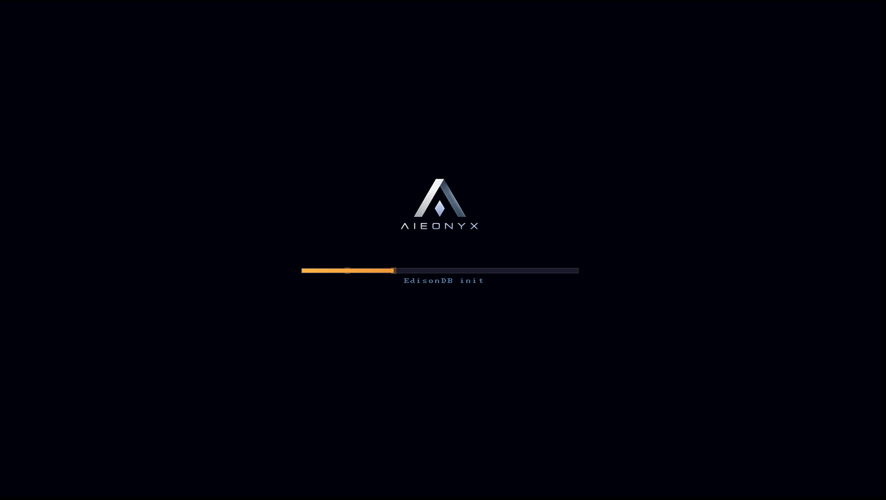
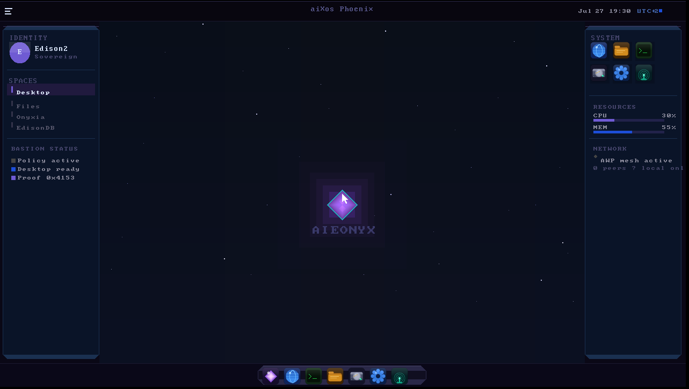

<p align="center">
  
  
</p>

<h1 align="center">aiXos Phoenix</h1>
<h3 align="center">The Sovereign Desktop OS by AIEONYX</h3>

<p align="center">
  <strong>Built in Rust. No Linux. No POSIX. Sovereignty from first instruction.</strong>
</p>

<p align="center">
  <a href="https://github.com/aieonyx/aixos/releases/tag/v1.0.0">v1.0.0</a> •
  <a href="https://github.com/aieonyx/AXON">AXONYX Language</a> •
  <a href="https://github.com/aieonyx/edisondb">EdisonDB</a> •
  <a href="https://github.com/aieonyx/asl">ASL-seL4 mKernel</a> •
  <a href="LICENSE">Apache-2.0</a>
</p>

<p align="center">
  
</p>

<p align="center">
  <strong>IDENTITY ESTABLISHED · PROOF EARNED · SOVEREIGN DESKTOP ON SCREEN</strong>
</p>

<hr>

## What is aiXos Phoenix?

**aiXos** is a sovereign desktop operating system by **AIEONYX** — written entirely in Rust, booting bare-metal on AArch64 with no Linux kernel, no POSIX layer, no GUI toolkit, and no external dependencies. Every pixel is drawn directly to the framebuffer. Every file is stored in AXFS. Every script is verified before it runs.

**Phoenix v1.0** is the first complete sovereign desktop: animated boot splash with the official AIEONYX logo, a full floating window manager, the Onyxia Browser with `awp://` routing, HANIEL document compositor, 3-panel file browser, cooperative process scheduler, and a `.axpkg` verify-before-run security gate — running entirely on bare-metal AArch64.

> *The user should own the machine, the identity, the data, and the rules of execution.*

<hr>

## Current State — v1.0.0

### Boot Splash

<p align="center">
  
</p>

The official AIEONYX logo renders at 192×128 ARGB on a pure black background. An ember gold (`#FFB347`) progress bar advances through **6 real boot stages** — each wired to actual initialization: hardware probe → EdisonDB → AXFS → sovereign heap → process table → desktop ready. No fake timers. The bar fills as each subsystem actually initializes.

### Desktop

<p align="center">
  
</p>

**Phoenix color system** — Midnight Blue `#0A1630` panels, Ember Gold `#FFB347` accents, Plum Glow `#6F5BD3` identity elements, Deep Sovereign Blue `#1D4ED8` primary accent.

**Left panel:** IDENTITY — purple avatar circle with user initial, name, "Sovereign" subtitle. SPACES — Desktop / Files / Onyxia / EdisonDB. BASTION STATUS — Policy active / Desktop ready / Proof 0x4153.

**Right panel:** SYSTEM — 6 real PNG icon bitmaps (Globe, Folder, Terminal, Disk, Gear, Antenna). RESOURCES — CPU 30% + MEM 55% bars. NETWORK — AWP mesh active / 0 peers · local only.

**Dock:** 7 real PNG icon bitmaps centered — AIEONYX orb, Globe (Onyxia), Terminal (Shell), Folder (Files), Disk (Storage), Gear (Settings), Antenna (Network).

<hr>

## What Works in v1.0.0

| Feature | Detail | Status |
|---------|--------|--------|
| Bare-metal AArch64 boot | EDK2 UEFI + PE/COFF stub, no Linux | ✅ |
| ramfb framebuffer | 1280×720 FORMAT_XR24, direct pixel writes | ✅ |
| Animated boot splash | Official AIEONYX logo + ember gold 6-stage progress bar | ✅ |
| Phoenix color system | Midnight Blue + Ember Gold + Plum Glow + Sovereign Blue | ✅ |
| Real PNG icon bitmaps | 7 dock + 6 panel icons, 32×32 ARGB compiled-in | ✅ |
| Identity avatar | Purple circle with user initial, name, subtitle | ✅ |
| Window manager | Spawn, drag, resize, minimize, maximize, close — 6 slots | ✅ |
| macOS-style chrome | Red/amber/green circles, right side | ✅ |
| Shell window | `axc>` prompt, 20+ commands, command history, tab complete | ✅ |
| Onyxia Browser | `awp://` sovereign web, 4 built-in pages | ✅ |
| HANIEL compositor | Document renderer — `##headers`, `>>highlights`, link list | ✅ |
| Built-in awp:// pages | aieonyx / about / status / iam / 404 | ✅ |
| EdisonDB | Live bare-metal sovereign store, ARPi provenance | ✅ |
| AXFS | Sovereign filesystem, read/write files | ✅ |
| File browser | 3-panel: sidebar + file list + preview + Open/Verify/Encrypt | ✅ |
| AXONYX runner | `run <file.ax>` — execute sovereign scripts | ✅ |
| `.axpkg` security gate | FNV-64 integrity + 6-cap deny-by-default model | ✅ |
| Cooperative scheduler | Round-robin, 8 slots, tick counter, `ps`/`spawn`/`kill` | ✅ |
| Process window | PID/NAME/ST/PRI/TICKS/YIELDS columns, live tick display | ✅ |
| AWP loopback | Protocol proven, mesh-ready | ✅ |
| virtio input | Keyboard + tablet mouse, drag/click/resize | ✅ |
| CI pipeline | build-debug + build-release + host tests + clippy | ✅ |

<hr>

## AXONYX Language in aiXos

AXONYX (`.ax`) is the sovereign systems language powering aiXos. It runs natively inside the OS:

```axon
// hello.ax — a sovereign script
let msg = "sovereign hello"
print msg
awp msg   // broadcast over AWP protocol
```

**What AXONYX achieves in aiXos v1.0:**

| Capability | How it's used |
|------------|--------------|
| `.ax` script execution | `run <file>` in the shell runs any AXON script bare-metal |
| `axon_interp` (P71.5) | Vendored upstream interpreter — MAX_LINES=64, binary ops, REPL state |
| `.axpkg` packages | `mkpkg` packs scripts with FNV-64 hash + capability bitmask |
| Verify-before-run | `run_verified` refuses to execute unverified packages |
| AWP integration | Scripts can send AWP frames if declared in capability mask |
| AArch64 codegen | P71 native codegen — aiXos can eventually be written in AXONYX |
| Sovereign package registry | P65 registry — future `.axpkg` distribution channel |

The full AXONYX compiler (P1–P72) lives at [github.com/aieonyx/AXON](https://github.com/aieonyx/AXON). aiXos ships the `axon_interp` crate as a vendored component.

<hr>

## Shell Commands

```
# System
help  clear  version  sovereignty  node-id  mem  reboot

# Files & Scripts
ls  cat  write  run  run_verified  mkpkg  verify

# Windows
window  settings  browse  close

# Network
awp  awp recv  awp-status

# Database
db

# Process
ps  spawn  kill

# Identity
name  tz
```

### Quick start after boot

```bash
# Navigate the sovereign web
# Click O (AIEONYX orb) in dock → type awp://aieonyx → Enter

# Write and run a sovereign script
write hello.ax
print "sovereign hello"
run hello.ax

# Pack and verify a sovereign package
mkpkg hello hello.ax
verify hello.axpkg        # → PASS name:hello script:... caps:0x00000000
run_verified hello.axpkg  # → sovereign hello

# Process table
ps                         # → procs:3 ticks:32000000
spawn worker               # → spawned pid:3
kill 3                     # → process killed

# Open file browser
# Click folder icon in dock → 3-panel browser opens
# Click a file → preview in right panel → click Open to execute
```

<hr>

## Sovereign Stack

| Component | Role | Status |
|-----------|------|--------|
| **aiXos Phoenix** | Sovereign desktop OS — bare-metal AArch64 | **v1.0.0 ✅** |
| **AXONYX** | Sovereign systems language (.ax) | P66 complete, vendored in aiXos |
| **EdisonDB** | Sovereign database (ARPi 78-byte provenance header) | Live bare-metal |
| **Onyxia** | Sovereign browser (awp://) | v1.1.0, integrated |
| **HANIEL** | Sovereign document compositor | PL-61 integrated |
| **AXFS** | Sovereign filesystem | Live |
| **AWP** | Sovereign network protocol (249 ISO regions) | Loopback proven |
| **ARPi** | Identity ceremony protocol (5-layer auth) | Hardware node ID active |
| **BASTION** | Policy enforcement | Shell loop active |
| **ASL-seL4** | Sovereign microkernel (M1–M24, 655+ tests) | Separate repo → v2.0 integration |
| **IAM** | Sovereign AI companion (350M params, Founding Spec v1.0) | Training pipeline pending |

<hr>

## How to Run

### Requirements

- QEMU 8.2.2+
- Rust 1.94.1 (pinned via `rust-toolchain.toml`)
- `aarch64-linux-gnu` cross toolchain
- `mtools`, `gdisk`, `qemu-efi-aarch64`

### Build and run

```bash
git clone https://github.com/aieonyx/aixos
cd aixos

bash build/build-iso.sh   # Build ELF + PE/COFF image
bash build/make-iso.sh    # Package bootable ISO
bash build/run-iso.sh     # Boot via EDK2 UEFI in QEMU
```

<hr>

## Boot Sequence

```
EDK2 UEFI firmware
  └── BOOTAA64.EFI (PE/COFF EFI stub)
      └── _start → aixos_main()
          ├── [splash] Stage 1: Hardware probe         ████░░░░░░░░ 16%
          ├── [splash] Stage 2: EdisonDB init          ████████░░░░ 33%
          ├── [splash] Stage 3: AXFS init              ████████████ 50%
          ├── [splash] Stage 4: Sovereign heap + 0x4153████████████████ 66%
          ├── [splash] Stage 5: Process table          ████████████████████ 83%
          ├── [splash] Stage 6: Desktop ready          ████████████████████████ 100%
          └── shell_loop() — UART + virtio keyboard active
```

<hr>

## Key Technical Facts

| Property | Value |
|----------|-------|
| Architecture | AArch64 bare-metal (`no_std`, no Linux) |
| Rust toolchain | 1.94.1 (pinned via rust-toolchain.toml) |
| Framebuffer | 1280×720 FORMAT_XR24 via ramfb |
| Sovereign proof | `0x4153` = `AS` (AIEONYX Sovereign) |
| Boot path | EDK2 → PE/COFF stub → `_start` → `aixos_main()` |
| Logo | Official AIEONYX logo, 192×128 ARGB compiled into binary |
| Icons | 7 real PNG bitmaps, 32×32 ARGB compiled into binary |
| Window manager | 6 slots, drag/resize/minimize/maximize/close |
| Process scheduler | Cooperative round-robin, 8 slots, no preemption |
| Security gate | FNV-64 hash + 6-capability deny-by-default model |
| axon_interp | Vendored from AXON P71.5 — MAX_LINES=64, binary ops |
| CI | aarch64 build + release + host tests + clippy — all green |

<hr>

## Roadmap

### v1.0.0 ✅ — Released
Complete sovereign desktop: Phoenix colors, real icon bitmaps, animated splash, file browser, `.axpkg` security gate, Onyxia Browser, HANIEL compositor, cooperative scheduler, axc> shell.

### v2.0 — ASL-seL4 Integration
The sovereign differentiator: formally verified microkernel isolation. No other GUI OS has this.

```
PL-70  seL4 boot handoff      UEFI → seL4 → GENESIS Protection Domain
PL-71  PD split               Shell, EDB, Onyxia, AXFS as isolated PDs
PL-72  ARPi-Broker wired      All inter-PD IPC through ARPi 5-layer auth
PL-73  AXON-Bridge PD         Scripts in capability-gated isolated PD
PL-74  HANIEL Canvas PD       GPU access via seL4 capability
PL-75  Full sovereign proof   All 6 mandatory PDs — TAG: v2.0
```

### IAM — Sovereign AI Companion
- 350M params · Ryzen 7 · hybrid SSM/attention · BLAKE3 everywhere
- Mission: *help human, never harm, maximum capacity, always*
- Epoch: *Wisdom is the Beginning*
- Training pipeline: axon_data (P67) + axon_train (P68) — in progress

<hr>

## License

**Apache-2.0** — permanently and irrevocably.

Copyright © 2026 Edison Lepiten / AIEONYX

<hr>

<div align="center">

**IDENTITY ESTABLISHED · PROOF EARNED · SOVEREIGN DESKTOP ON SCREEN**

*aiXos Phoenix v1.0.0 — The Sovereign Desktop OS by AIEONYX*

*For ordinary people. Not corporations.*

</div>
